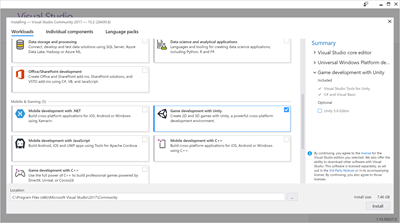
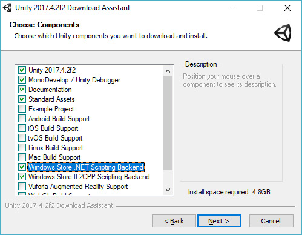
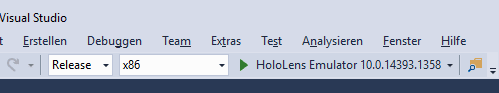

# Unity-Entwicklung für Microsoft Hololens

Die Game-Engine Unity erleichtert die Entwicklung für Microsoft Hololens, benötigt aber einige Installationsschritte. Bitte befolgen Sie die Schritte in dieser Anleitung und testen Sie die Installationen vor dem Workshop (siehe Schritt 5).

## 1. Visual Studio Community 2017 installieren

`Visual Studio Community 2017` kann kostenlos auf Windows und macOS installiert werden. Zur Nutzung wird ein Microsoft-Konto benötigt. Der mit Unity mitgelieferte Editor `Mono Develop` reicht für die HoloLens-Entwicklung nicht aus!

1. Besuchen Sie https://www.visualstudio.com/de/vs/community/ und laden Sie Visual Studio Community 2017 für Ihr Betriebssystem herunter.
1. Starten Sie die Installation.
1. Setzen Sie einen Haken bei `Universal Windows Platform development`
 
1. Setzen Sie einen Haken bei `Game Development with Unity`, aber wählen Sie den optionalen Unity-Editor in der rechten Seitenleiste ab.
 
1. Schließen Sie die Installation ab. Öffnen Sie Visual Studio und melden Sie sich mit einem Microsoft-Account an.

## 2. Unity 2017.4 installieren

`Unity 2017.4` ist die neuste Version der Game-Engine Unity und ist für Windows und macOS verfügbar.

1. Besuchen Sie https://unity3d.com/de/unity/qa/lts-releases und laden Sie die neuste Unity-Version für Ihr Betriessystem herunter.
1. Starten Sie die Installation.
1. Stellen Sie sicher, dass Sie `Windows Store.NET Scripting Backend` ausgewählt haben. Am besten orientieren Sie sich an dem Screenshot.
 
1. Schließen Sie die Installation ab und starten Sie Unity, um die Installation zu testen.

## 3. MixedRealityToolkit für Unity herunterladen

Das `Microsoft MixedRealityToolkit` ist eine Erweiterung für Unity, das die Entwicklung deutlich vereinfacht. Sie benötigen zwei Packages, die wir im laufe des Workshops verwenden werden.

1. Besuchen Sie https://github.com/Microsoft/MixedRealityToolkit-Unity/releases/tag/2017.2.1.4.
1. Laden Sie die beiden Packages `HoloToolkit-Unity-2017.2.1.4.unitypackage` und `HoloToolkit-Unity-Examples-2017.2.1.4.unitypackage` herunter. Merken oder notieren Sie sich, wo Sie die dateien abgelegt haben.

## 4. Hololens emulator installieren (optional)

HoloLens-Programme sollten am besten immer mal wieder auf einem Gerät getestet werden, weil im Unity-Editor manche Eingabemöglichkeiten einfach nicht funktionieren. Alternativ dazu stellt Microsoft einen [HoloLens-Emulator](https://docs.microsoft.com/en-us/windows/mixed-reality/using-the-hololens-emulator) bereit. Der Emulator läuft nur auf auf 64-bit Windows 10 Pro, Enterprise oder Education und ist etwas hackelig zu installieren.

1. Besuchen Sie https://docs.microsoft.com/en-us/windows/mixed-reality/install-the-tools und installieren Sie `HoloLens Emulator and Holographic Templates`. Bitte lesen Sie sich vorher die System-Voraussetzungen genau durch.
1. Bei eventuellen Problemen, lesen Sie sich bitte den Troubleshooting-Abschnitt auf der oben genannten Seite durch und überprüfen Sie ggf. ihre BIOS-Einstellungen.

## 5. Installationen testen

1. [Klonen](https://help.github.com/articles/cloning-a-repository/) Sie dieses Projekt mit GIT. Stellen Sie bitte sicher, dass der Pfad zum Projekt keine Umlaute oder andere Sonderzeichen enthält.
1. Wechseln Sie in den neu erstellten Ordner und öffnen Sie die Unity-Szene unter `UnityProject/Assets/Scenes/test.unity`. Unity sollte sich nun öffnen.
1. Wählen Sie innerhalb von Unity `Mixed Realitiy Toolkit > Build Window > Configure > Apply Mixed Reality Project Settings > Apply` - das kann etwas dauern.
1. Öffnen Sie ein neues Fenster `Mixed Realitiy Toolkit > Build Window`.
1. Klicken Sie auf `Build Unity Project`. Das Projekt wird nun für Visual Studio exportiert - das kann etwas dauern.
1. Klicken Sie auf `Open in Visual Studio`, um das Projekt dort zu öffnen. Stellen Sie sicher, dass sich das eben installierte Visual Studio Community 2017 öffnet und keine Fehlermeldungen anzeigt.
1. (Optional) Falls Sie den Emulator installiert haben, wählen Sie in der oberen Leiste `Release`, `x86` und `HoloLens Emulator <xxx>`.
 
 Wählen Sie danach `Debuggen > Starten ohne Debugging` aus, um das Projekt auf dem Emulator zu starten.

## 6. Weitere Ressourcen

1. Nochmal eine Übersicht von Microsoft über benötigte Tools: https://docs.microsoft.com/en-us/windows/mixed-reality/install-the-tools
1. Unity-Dokumentation: https://docs.unity3d.com/Manual/index.html
1. Unity-Videotutorials und Beispiel-Projekte: https://unity3d.com/de/learn
1. Unity-Asset-Store: https://www.assetstore.unity3d.com/
1. Microsoft MixedRealityToolkit für Unity: https://github.com/Microsoft/MixedRealityToolkit-Unity
1. Video-Tutorials von Microsoft: https://docs.microsoft.com/de-de/windows/mixed-reality/academy
